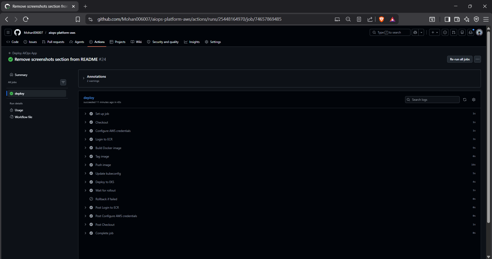
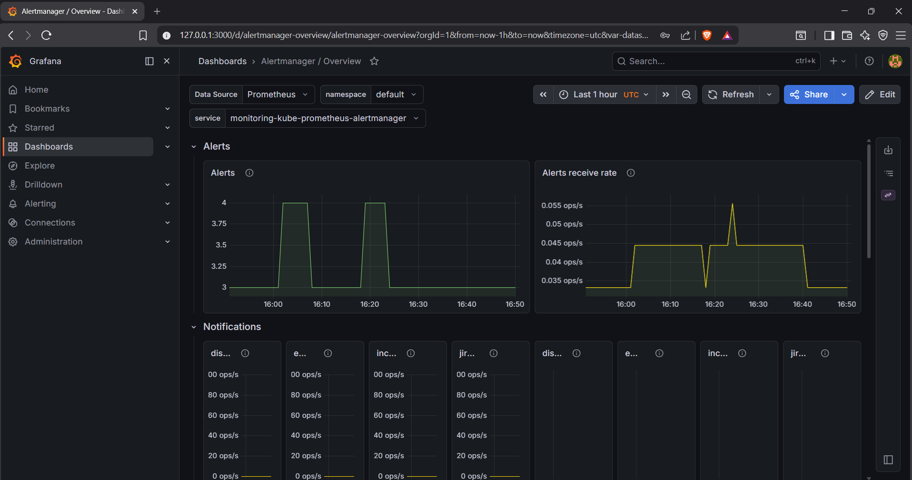
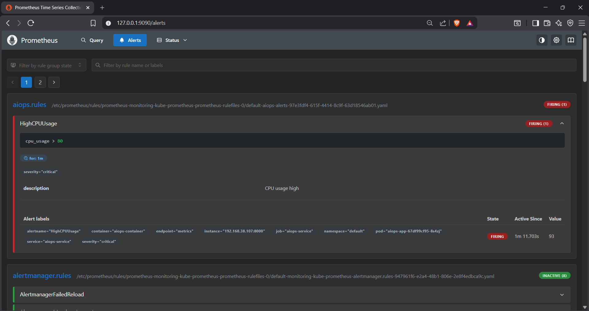
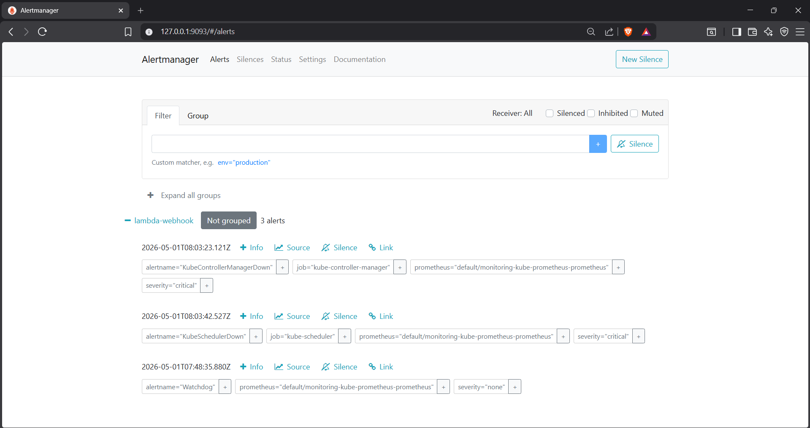
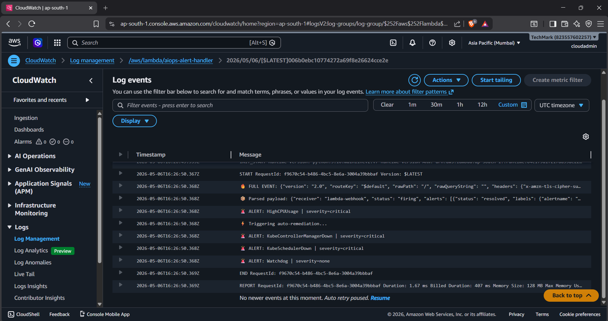
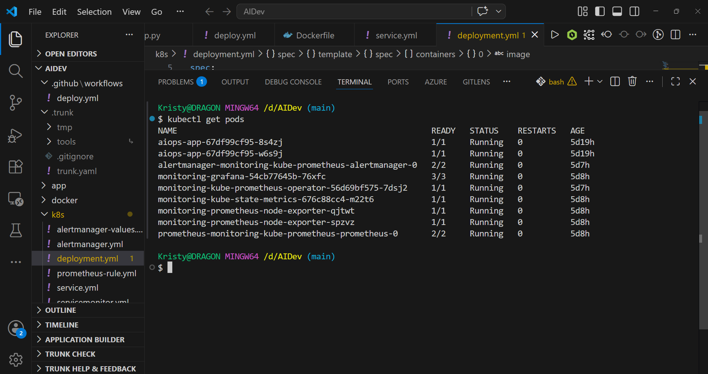

# 🚀 AI-Driven Self-Healing AIOps Platform on AWS

Production-grade cloud-native AIOps platform built on AWS using Kubernetes (EKS), Prometheus, Grafana, Alertmanager, GitHub Actions, and AWS Lambda for automated monitoring, alerting, CI/CD, and self-healing remediation workflows.

---

# 📌 Project Overview

This project simulates a real-world AIOps/DevOps environment with:

- Kubernetes-based application deployment on Amazon EKS
- Real-time observability using Prometheus + Grafana
- Automated CI/CD pipeline with GitHub Actions
- Alert-driven incident response using Alertmanager
- AWS Lambda webhook integration for automated remediation
- Self-healing deployment rollback and recovery workflows

The platform demonstrates how modern SRE/DevOps systems can automatically detect, analyze, and respond to infrastructure and application failures in real time.

---

# 🏗️ Architecture

```text
GitHub Actions
        ↓
Docker Build & Push
        ↓
Amazon ECR
        ↓
Amazon EKS (Kubernetes)
        ↓
Prometheus Metrics Collection
        ↓
Alertmanager
        ↓
AWS Lambda Webhook
        ↓
Automated Remediation / Incident Response
```

---

# ⚙️ Tech Stack

| Category | Technologies |
|---|---|
| Cloud | AWS |
| Containerization | Docker |
| Orchestration | Kubernetes (EKS) |
| Monitoring | Prometheus |
| Visualization | Grafana |
| Alerting | Alertmanager |
| Automation | AWS Lambda |
| CI/CD | GitHub Actions |
| Registry | Amazon ECR |
| Language | Python (Flask) |

---

# 🔥 Key Features

## ✅ Kubernetes Deployment on AWS EKS
- Containerized Flask application deployed on Amazon EKS
- Multi-replica deployment with rolling updates
- Health checks using readiness/liveness probes

## ✅ Real-Time Monitoring
- Prometheus metrics scraping
- Custom application metrics exposed via Prometheus client
- Grafana dashboards for observability

## ✅ Automated CI/CD Pipeline
- GitHub Actions pipeline for:
  - Docker image build
  - ECR image push
  - Kubernetes deployment
  - Rollout validation
  - Automatic rollback on failure

## ✅ Intelligent Alerting
- Prometheus alert rules
- Alertmanager webhook integration
- Real-time incident detection

## ✅ Auto-Remediation Workflow
- Alertmanager triggers AWS Lambda
- Lambda processes critical alerts
- Event-driven remediation architecture for self-healing systems

---

# 📊 Monitoring & Alerting Flow

```text
Application Metrics
        ↓
Prometheus
        ↓
Alert Rules
        ↓
Alertmanager
        ↓
AWS Lambda
        ↓
Incident Response / Automation
```

---

# 🔄 CI/CD Workflow

```text
Developer Push
        ↓
GitHub Actions Trigger
        ↓
Docker Image Build
        ↓
Push to Amazon ECR
        ↓
Deploy to Amazon EKS
        ↓
Rollout Verification
        ↓
Automatic Rollback on Failure
```

---

# 📁 Project Structure

```bash
aiops-platform-aws/
│
├── .github/workflows/      # GitHub Actions CI/CD
├── app/                    # Flask application
├── docker/                 # Docker configuration
├── k8s/                    # Kubernetes manifests
├── screenshots/            # Project screenshots
├── README.md
```

---

# 🚀 Deployment Steps

## 1️⃣ Clone Repository

```bash
git clone https://github.com/Mohan006007/aiops-platform-aws.git
cd aiops-platform-aws
```

---

## 2️⃣ Build Docker Image

```bash
docker build -t aiops-app -f docker/Dockerfile .
```

---

## 3️⃣ Push Image to Amazon ECR

```bash
docker tag aiops-app:latest <ECR-URL>/aiops-app:latest
docker push <ECR-URL>/aiops-app:latest
```

---

## 4️⃣ Deploy to Kubernetes

```bash
kubectl apply -f k8s/deployment.yml
kubectl apply -f k8s/service.yml
```

---

## 5️⃣ Install Monitoring Stack

```bash
helm install monitoring prometheus-community/kube-prometheus-stack
```

---

# 📈 Example Alert Rule

```yaml
groups:
- name: aiops-alerts
  rules:
  - alert: HighCPUUsage
    expr: cpu_usage > 80
    for: 1m
    labels:
      severity: critical
```

---

# 🤖 Lambda Auto-Remediation

AWS Lambda receives Alertmanager webhooks and processes critical alerts for automated remediation workflows.

Example:

```python
if name == "HighCPUUsage":
    print("⚡ Triggering auto-remediation...")
```

---

# 📸 Screenshots

## GitHub Actions CI/CD


---

## Grafana Dashboard


---

## Prometheus Alerts


---

## Alertmanager UI


---

## AWS Lambda Logs


---

## Kubernetes Pods


---

# 💡 Learning Outcomes

This project demonstrates practical experience with:

- Kubernetes administration
- Cloud-native observability
- CI/CD automation
- Incident response workflows
- Self-healing infrastructure concepts
- Monitoring and alerting pipelines
- Production troubleshooting/debugging

---

# 🔮 Future Improvements

- AI-powered root cause analysis
- Slack / Teams alert integration
- Kubernetes auto-scaling
- Cost anomaly detection
- Intelligent alert correlation
- Step Functions remediation workflows

---

# 👨‍💻 Author

### Mohana Krishnan

- GitHub: https://github.com/Mohan006007

---

# ⭐ If you found this useful

Give this repository a ⭐ on GitHub.
